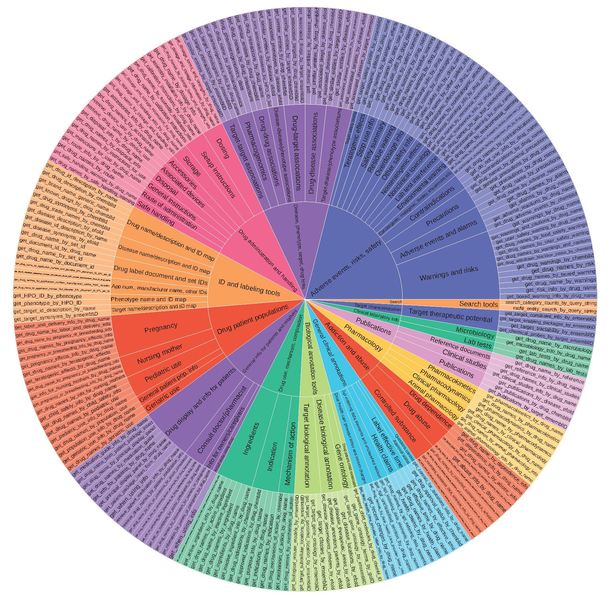

# ToolUniverse: Scientific Model Context Protocol

[](https://zitniklab.hms.harvard.edu/TxAgent)
[](https://arxiv.org/pdf/2503.10970)
[](https://pypi.org/project/txagent/)
[](https://pypi.org/project/tooluniverse/)
[](https://github.com/mims-harvard/TxAgent)
[](https://github.com/mims-harvard/ToolUniverse)
[](https://huggingface.co/collections/mims-harvard/txagent-67c8e54a9d03a429bb0c622c)
[_Supported-green)](README_USAGE.md#running-the-mcp-server)

  <body>
    <section class="hero">
      <div class="hero-body">
        <div class="container is-max-desktop">
          <div class="columns is-centered">
            <div class="column has-text-centered">
              <h1 class="title is-1 publication-title">
              </h1>
              <div class="is-size-5 publication-authors">
                <!-- Paper authors -->
                <span class="author-block">
                  <a href="https://shgao.site" target="_blank">Shanghua Gao</a
                  >,</span
                >
                <span class="author-block">
                  <a
                    href="https://www.linkedin.com/in/richard-zhu-4236901a7/"
                    target="_blank"
                    >Richard Zhu</a
                  >,</span
                >
                <span class="author-block">
                  <a href="https://zlkong.github.io/homepage/" target="_blank"
                    >Zhenglun Kong</a
                  >,</span
                >
                <span class="author-block">
                  <a href="https://www.ayushnoori.com/" target="_blank"
                    >Ayush Noori</a
                  >,</span
                >
                <span class="author-block">
                  <a
                    href="https://scholar.google.com/citations?hl=zh-CN&user=Awdn73MAAAAJ"
                    target="_blank"
                    >Xiaorui Su</a
                  >,</span
                >
                <span class="author-block">
                  <a
                    href="https://www.linkedin.com/in/curtisginder/"
                    target="_blank"
                    >Curtis Ginder</a
                  >,</span
                >
                <span class="author-block">
                  <a href="https://sites.google.com/view/theo-t" target="_blank"
                    >Theodoros Tsiligkaridis</a
                  >,</span
                >
                <span class="author-block">
                  <a href="https://zitniklab.hms.harvard.edu/" target="_blank"
                    >Marinka Zitnik</a
                  >
              </div>


ToolUniverse is a collection of biomedical tools designed for use by Agentic AI. It is a critical component of TxAgent, providing the agent with the ability to access and leverage a vast array of biomedical knowledge to solve complex therapeutic reasoning tasks. ToolUniverse includes 211 biomedical tools that address various aspects of drugs and diseases. These tools are linked to trusted sources, including all US FDA-approved drugs since 1939 and validated clinical insights from Open Targets and Monarch Initiative.




# Install

### Install from source

```
python -m pip install . --no-cache-dir
```

### Install from Pypi
Pip page (https://pypi.org/project/tooluniverse)

```
pip install tooluniverse
```

# Usage

ToolUniverse supports both a Python SDK and an MCP server interface. 
- You can use the Python SDK to interact with ToolUniverse programmatically in your Python projects.
- You can connect to the ToolUniverse MCP server for remote tool execution and integration with other agentic systems.

For more detailed usage examples, see the [README_USAGE](README_USAGE.md) page.

For MCP integration with Claude Desktop App, see the [MCP for Claude Tutorial](doc/MCP_for_Claude.md).

## Citation

```
@misc{gao2025txagent,
      title={TxAgent: An AI Agent for Therapeutic Reasoning Across a Universe of Tools}, 
      author={Shanghua Gao and Richard Zhu and Zhenglun Kong and Ayush Noori and Xiaorui Su and Curtis Ginder and Theodoros Tsiligkaridis and Marinka Zitnik},
      year={2025},
      eprint={2503.10970},
      archivePrefix={arXiv},
      primaryClass={cs.AI},
      url={https://arxiv.org/abs/2503.10970}, 
}
```

## Contact
If you have any questions or suggestions, please email [Shanghua Gao](mailto:shanghuagao@gmail.com) and [Marinka Zitnik](mailto:marinka@hms.harvard.edu).

## Core contributors

[Shanghua Gao](https://shgao.site);
[Richard Zhu](https://www.linkedin.com/in/richard-zhu-4236901a7/);
[Zhenglun Kong](https://zlkong.github.io/homepage/);
[Sufian Aldogom](saldogom@mit.edu)
